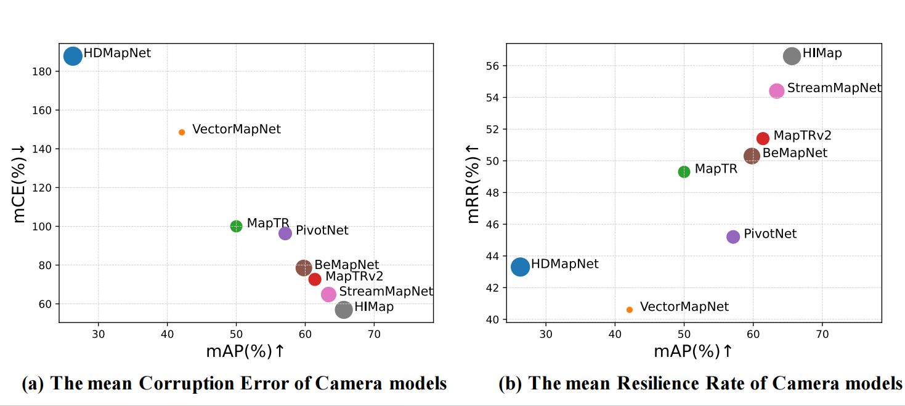
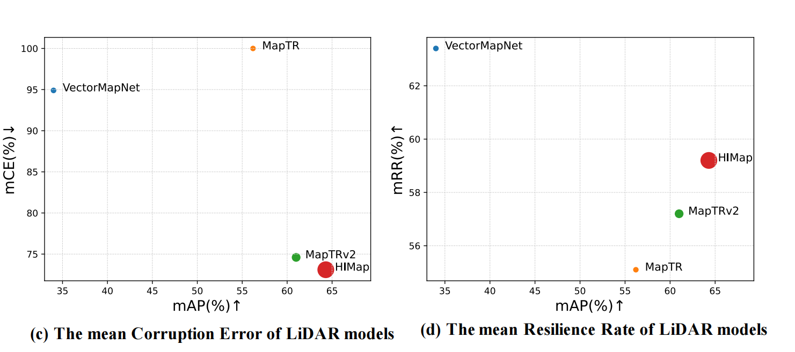
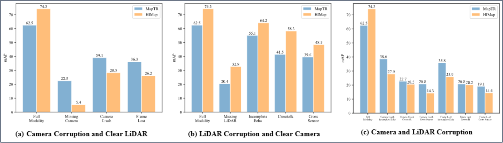

 

  
  
  <h3 align="center"><strong>RoboMap: Is Your HD Map Constructor Reliable under Sensor Corruptions? </strong></h3>

  

  

  
  
  
  
  

## About
`RoboMap`

## Updates

## Outline
- [About](#about)
- [Updates](#updates)
- [Outline](#outline)
- [Installation](#installation)
- [Data Preparation](#data-preparation)
- [Getting Started](#getting-started)
- [Taxonomy](#taxonomy)
  - [camera corruptions](#camera-corruptions)
  - [LiDAR corruptions](#lidar-corruptions)
- [Model Zoo](#model-zoo)
- [Benchmark](#benchmark)
  - [HD Map construction on nuScenes](#hd-map-construction-on-nuscenes)
    - [Camera-only](#camera-only)
    - [LiDAR-only](#lidar-only)
    - [Fusion](#fusion)
- [Create Corruption Sets](#create-corruption-sets)
- [TODO List](#todo-list)
- [Citation](#citation)
- [License](#license)
- [Acknowledgements](#acknowledgements)

## Installation
For details related to installation, kindly refer to [INSTALL.md](docs/INSTALL.md).

## Data Preparation

Kindly refer to [DATA_PREPARE.md](docs/DATA_PREPARE.md) for the details to prepare the 1`nuScenes`, 2`nuScenes-c`, 3`nuScenes-C` datasets.

## Getting Started

To learn more usage about this codebase, kindly refer to [GET_STARTED.md](docs/GET_STARTED.md).

## Taxonomy
### camera corruptions

|  |  |  |
| :---: | :---: | :---: |
| **Clean** | **Camera** | **Frame** |
|  |  | 
| **Quant** | **Motion** | **Bright** |
|  |  |  | 
| **Dark** | **Fog** | **Snow** |

### LiDAR corruptions

|  |  |  |
| :---: | :---: | :---: |
| **Clean** | **Fog** | **Wet** |
|  |  | 
| **Snow** | **Motion** | **Beam** |
|  |  |  | 
| **Crosstalk** | **Echo** | **Sensor** |

## Model Zoo

&nbsp<b>HD Map Construction</b>

> - [x] **[HDMapNet](https://arxiv.org/abs/2107.06307), ICRA 2022.** [**`[Code]`**](https://github.com/Tsinghua-MARS-Lab/HDMapNet)

> - [x] **[VectorMapNet](https://arxiv.org/abs/2206.08920), ICML 2023.** [**`[Code]`**](https://github.com/Mrmoore98/VectorMapNet_code)

> - [x] **[MapTR](https://arxiv.org/abs/2208.14437), ICLR 2023.** [**`[Code]`**](https://github.com/hustvl/MapTR)

> - [x] **[MapTRv2](https://arxiv.org/abs/2308.05736), arXiv 2023.** [**`[Code]`**](https://github.com/hustvl/MapTR)

> - [x] **[PivotNet](https://arxiv.org/pdf/2308.16477), ICCV 2023.** [**`[Code]`**](https://github.com/wenjie710/PivotNet)

> - [x] **[BeMapNet](https://openaccess.thecvf.com/content/CVPR2023/html/Qiao_End-to-End_Vectorized_HD-Map_Construction_With_Piecewise_Bezier_Curve_CVPR_2023_paper.html), CVPR 2023.** [**`[Code]`**](https://github.com/er-muyue/BeMapNet)

> - [x] **[StreamMapNet](https://arxiv.org/abs/2308.12570), WACV 2024.** [**`[Code]`**](https://github.com/yuantianyuan01/StreamMapNet)

> - [x] **[HIMap](https://arxiv.org/abs/2308.12570), CVPR 2024.** [**`[Code]`**]()

## Benchmark

### HD Map construction on nuScenes

#### Camera-only 

  

| Model            | mCE | mRR | Clean  | Camera | Frame | Quant | Motion | Bright | Dark | Fog | Snow |
| :--------------: | :-----: | :-----: |:-----: | :-------: | :--------: | :---------: | :---------: | :----: | :-------: | :----: | :----: |
|**[HDMapNet](https://arxiv.org/abs/2107.06307), ICRA 2022.** [**`[Code]`**](https://github.com/Tsinghua-MARS-Lab/HDMapNet)      |18.7.8|43.3|23.0|4.6|5.1|18.9|20.8|16.7|9.3|10.6|5.2|
|**[VectorMapNet](https://arxiv.org/abs/2206.08920), ICML 2023.** [**`[Code]`**](https://github.com/Mrmoore98/VectorMapNet_code) |148.5|40.6|40.9|13.9|12.3|26.6|29.7|25.2|7.8|18.3|2.9|
|**[PivotNet](https://arxiv.org/pdf/2308.16477), ICCV 2023.** [**`[Code]`**](https://github.com/wenjie710/PivotNet)              |96.3|45.2|57.4|17.1|16.7|36.4|34.1|43.5|16.5|37.4|4.6|
|**[BeMapNet](https://openaccess.thecvf.com/content/CVPR2023/html/Qiao_End-to-End_Vectorized_HD-Map_Construction_With_Piecewise_Bezier_Curve_CVPR_2023_paper.html), CVPR 2023.** [**`[Code]`**](https://github.com/er-muyue/BeMapNet)               |78.5|50.3|59.8|18.8|18.5|38.1|35.3|50.7|23.2|46.5|9.6|
|**[MapTR](https://arxiv.org/abs/2208.14437), ICLR 2023.** [**`[Code]`**](https://github.com/hustvl/MapTR)                       |100.0|49.3|50.3|15.0|14.2|35.4|23.5|44.3|22.7|38.5|3.8|
|**[MapTRv2](https://arxiv.org/abs/2308.05736), arXiv 2023.** [**`[Code]`**](https://github.com/hustvl/MapTR)                     |72.6|51.4|61.5|18.8|18.2|45.3|31.0|54.9|32.3|50.7|1.1|
|**[StreamMapNet](https://arxiv.org/abs/2308.12570), WACV 2024.** [**`[Code]`**](https://github.com/yuantianyuan01/StreamMapNet) |64.8|54.4|63.4|13.4|15.5|48.1|44.3|57.0|36.1|52.4|9.1|
|**[HIMap](https://arxiv.org/abs/2308.12570), CVPR 2024.** [**`[Code]`**]()                                                      |56.9|56.6|65.5|19.4|19.0|52.0|42.5|60.9|40.6|57.1|5.1|

#### LiDAR-only 

  

| Model            | mCE | mRR | Clean  | Fog | Wet | Snow | Motion | Beam | Crosstalk | Echo | Sensor |
| :--------------: | :-----: | :-----: |:-----: | :-------: | :--------: | :---------: | :---------: | :----: | :-------: | :----: | :----: |
|**[VectorMapNet](https://arxiv.org/abs/2206.08920), ICML 2023.** [**`[Code]`**](https://github.com/Mrmoore98/VectorMapNet_code) |94.9|63.4|34.0|15.7|20.3|15.9|28.8|19.2|19.7|31.3|9.5|
|**[MapTR](https://arxiv.org/abs/2208.14437), ICLR 2023.** [**`[Code]`**](https://github.com/hustvl/MapTR)                       |100.0|55.1|55.6|19.9|19.1|9.6|27.1|16.5|16.3|32.3|6.4|
|**[MapTRv2](https://arxiv.org/abs/2308.05736), arXiv 2023.** [**`[Code]`**](https://github.com/hustvl/MapTR)                     |74.6|57.2|61.5|28.5|29.5|10.3|36.9|27.9|15.4|44.7|14.0|
|**[HIMap](https://arxiv.org/abs/2308.12570), CVPR 2024.** [**`[Code]`**]()                                                      |73.1|59.2|64.3|26.6|24.6|16.1|37.4|24.4|26.7|43.1|10.8|

#### Fusion

  

| Model            | Modality | Camera | Lidar  | APped | APdiv | APbou | mAP | 
| :--------------: | :-----: | :-----: |:-----: | :-------: | :--------: | :---------: | :---------: |
|MapTR  | C & L | ✓          | ✓             |55.9|62.3|69.3|62.5|
|MapTR  |   C   | ✓          |  —            |46.3|51.5|53.1|50.3|
|MapTR  |   C   |Camera Crash |  —            |18.0|14.5|12.4|15.0|
|MapTR  |   C   |Frame Lost   |  —            |13.9|15.1|13.4|14.2|
|MapTR  | C & L | ✗          |  —            |15.0|18.2|34.4|22.5|
|MapTR  | C & L |Camera Crash |  —            |32.5|36.5|48.4|39.1|
|MapTR  | C & L |Frame Lost   |  —            |29.1|33.7|46.1|36.3|
|MapTR  |   L   | —           | ✓            |26.6|31.7|41.8|33.4|
|MapTR  |   L   | —           |Incomplete Echo|26.3|29.9|40.6|32.3|
|MapTR  |   L   | —           |Crosstalk      |13.6|15.0|20.3|16.3|
|MapTR  |   L   | —           |Cross-Sensor   |3.5|6.6|8.9|6.4|
|MapTR  | C & L | ✓          | ✗          |20.7|27.4|13.1|20.4|
|MapTR  | C & L | ✓          |Incomplete Echo|47.9|55.2|62.2|55.1|
|MapTR  | C & L | ✓          |Crosstalk      |36.7|42.5|45.3|41.5|
|MapTR  | C & L | ✓          |Cross-Sensor   |33.9|42.9|42.0|39.6|
|MapTR  | C & L |Camera Crash |Incomplete Echo|32.4|35.6|47.8|38.6|
|MapTR  | C & L |Camera Crash |Crosstalk      |19.7|21.6|26.9|22.7|
|MapTR  | C & L |Camera Crash |Cross-Sensor   |18.4|20.8|23.2|20.8|
|MapTR  | C & L |Frame Lost   |Incomplete Echo|28.9|32.8|45.5|35.8|
|MapTR  | C & L |Frame Lost   |Crosstalk      |16.9|19.9|25.5|20.8|
|MapTR  | C & L |Frame Lost   |Cross-Sensor   |15.8|19.4|22.2|19.1|

| Model            | Modality | Camera | Lidar  | APped | APdiv | APbou | mAP | 
| :--------------: | :-----: | :-----: |:-----: | :-------: | :--------: | :---------: | :---------: |
|HIMap  | C & L | ✓          | ✓              |71.0|72.4|79.4|74.3|
|HIMap  |   C   | ✓          |  —            |62.2|66.5|67.9|65.5|
|HIMap  |   C   |Camera Crash |  —            |27.3|19.4|11.6|19.4|
|HIMap  |   C   |Frame Lost   |  —            |21.7|19.1|16.1|19.0|
|HIMap  | C & L | ✗          |  —            |40.9|46.4|74.7|50.7|
|HIMap  | C & L |Camera Crash |  —            |36.3|27.7|20.9|28.3|
|HIMap  | C & L |Frame Lost   |  —            |29.9|25.0|23.8|26.2|
|HIMap  |   L   | —           | ✓            |54.8|64.7|73.5|64.3|
|HIMap  |   L   | —           |Incomplete Echo|35.4|41.1|52.7|43.1|
|HIMap  |   L   | —           |Crosstalk      |20.9|23.8|35.3|26.7|
|HIMap  |   L   | —           |Cross-Sensor   |7.8|10.2|14.4|10.8|
|HIMap  | C & L | ✓          | ✗          |30.7|38.7|29.0|32.8|
|HIMap  | C & L | ✓          |Incomplete Echo|59.1|63.7|69.9|64.2|
|HIMap  | C & L | ✓          |Crosstalk      |54.1|57.5|63.4|58.3|
|HIMap  | C & L | ✓          |Cross-Sensor   |44.2|50.7|50.8|48.5|
|HIMap  | C & L |Camera Crash |Incomplete Echo|36.2|26.9|20.5|27.9|
|HIMap  | C & L |Camera Crash |Crosstalk      |29.2|19.3|12.9|20.5|
|HIMap  | C & L |Camera Crash |Cross-Sensor   |23.1|13.8|5.9|14.3|
|HIMap  | C & L |Frame Lost   |Incomplete Echo|29.9|24.4|23.5|25.9|
|HIMap  | C & L |Frame Lost   |Crosstalk      |23.6|18.9|18.0|20.2|
|HIMap  | C & L |Frame Lost   |Cross-Sensor   |17.7|14.3|11.2|14.4|

## Create Corruption Sets
You can manage to create your own "RobMap" corrpution sets! Follow the instructions listed in [CREATE.md](docs/CREATE.md).

## TODO List
- [x] Initial release. 🚀
- [ ] Add scripts for creating common corruptions.
- [ ] Add evaluation scripts on corruption sets.
- [ ] ...

## Citation
If you find this work helpful, please kindly consider citing our paper:

## License

 
This work is under the <a rel="license" href="http://creativecommons.org/licenses/by-nc-sa/4.0/">Creative Commons Attribution-NonCommercial-ShareAlike 4.0 International License</a>, while some specific operations in this codebase might be with other licenses. Please refer to [LICENSE.md](docs/LICENSE.md) for a more careful check, if you are using our code for commercial matters.

## Acknowledgements
